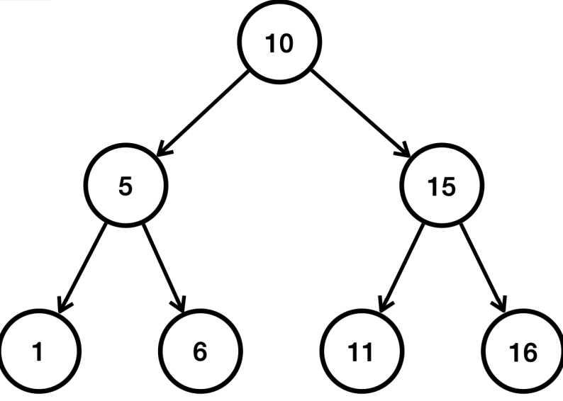

# 김영한의 실전 자바 - 중급 2편(Java mid2)

## 제네릭(Generic)

### 제네릭이 필요한 이유
코드 재사용과 타입 안정성을 동시 확보할 수 있음

### 제네릭 용어
* 타입 매개변수
* 타입 인자

#### 제네릭 명명 관례
* E - Element
* K - Key
* N - Number
* T - Type
* V - Value
* S, U, V etc. - 2nd, 3rd, 4th types 

## 타입 이레이저(Type Eraser)
제네릭은 컴파일 단계에서만 사용, 이후에는 제네릭 정보가 삭제됨. 제네릭에 사용한 타입 매개변수가 모두 사라지는 것.  
컴파일 전 .java에는 제네릭의 타입 매개변수가 존재하지만 바이트코드 .class에서는 타입 매개변수가 존재하지 않음.

## 배열의 특징1 - 배열과 인덱스
배열과 같이 여러 데이터를 구조화해 다루는 것은 자료구조.  

자바는 배열 뿐만 아닌 컬렉션 프레임워크라는 이름의 다양한 자료구조를 제공.

## 배열의 특징
* 배열에서 자료를 찾을 때 인덱스를 사용하면 매우 빠르게 자료를 찾을 수 있다.
* 인덱스를 통한 입력 변경 조회의 경우 한 번의 계산으로 자료의 위치를 찾을 수 있다.

### 배열 공식
* 배열의 시작 참조 + (자료의 크기 * 인덱스 위치)
    + arr[0]: x100 + (4byte * 0): x100
    + arr[1]: x100 + (4byte * 1): x104
    + arr[2]: x100 + (4byte * 2): x108  

**단 한 번의 연산으로 필요한 위치를 찾을 수 있음**

### 배열의 검색
배열에 들어있는 데이터를 찾는 것.  
배열에 들어있는 데이터를 검색할 때 배열에 들어있는 데이터 하나하나를 비교해야함.  
이때 인덱스를 사용해 한 번에 찾는 것이 불가하다.  
배열의 크기가 클수록 오랜 시간이 걸림.

* arr[0] - > 1회
* arr[1] - > 2회
* arr[9] - > 10회
* arr[999] - > 1000회의 연산이 필요.  

**배열의 순차 검색은 데이터의 크기 만큼 연산이 필요 -> 배열의 크기가 n이면 연산도 n만큼 필요하다.**

## 빅오(O) 표기법
빅오(Big O) 표기법은 알고리즘의 성능을 분석할 때 사용하는 수학적 표현 방식.

이는 알고리즘이 처리해야 할 데이터의 양이 증가할 때, 그 알고리즘이 얼마나 빨게 실행되는지 나타냄.

알고리즘의 정확한 실행 시간을 계산하는 것이 아닌, 데이터의 양의 증가에 따라 성능의 변화 추세를 이해하는 것.

**빅오 표기법의 예시**
* O(1) - 상수 시간: 입력 데이터의 크기에 관계 없이 알고리즘의 실행 시간이 일정함.
    + 배열에서 인덱스를 사용하는 경우
* O(n) - 선형 시간: 알고리즘의 실행 시간이 입력 데이터의 크기에 비례하여 증가함
    + 배열의 검색, 배열의 모든 요소를 순회하는 경우
* O(n²) - 제곱 시간: 알고리즘의 실행 시간이 입력 데이터의 크기의 제곱에 비례하여 증가함
    + 보통 이중 루프를 사용하는 알고리즘에서 나타남
* O(log n) - 로그 시간: 알고리즘의 실행 시간이 데이터 크기의 로그에 비례하여 증가함
    + 이진 탐색
* O(n log n) - 선형 로그 시간
    + 많은 효율적인 정렬 알고리즘

빅오 표기법은 매우 큰 데이터를 입력한다고 가정하고, 데이터 양 증가에 따른 성능의 추이를 비교하기 위해 사용됨.  
상수 시간은 O(1)은 크게 의미가 없어져서 빅오 표기법에서는 상수는 제거합  
예를 들어 O(n+2), O(n/2) 모두 O(n)으로 표시함.

빅오 표기법은 별도의 이야기가 없으면 보통 최악의 상황을 가정해 표기함.
최적, 보통, 최악의 경우로 표기하는 경우도 있음.

* 최적: 배열의 첫번째 항목에서 바로 값을 찾으면 O(1)
* 최악: 마지막 항목에 있거나 항목이 없는 경우 전체 요소를 순회 O(n)
* 보통: 평균적으로 중간쯤 데이터 발견. O(n), 최악과 비교를 위해 O(n/2)로 사용되기도 함.

## 배열의 특징2 - 데이터 추가

### 데이터 추가 예시
* 배열의 첫 번째 위치에 추가
* 배열의 중간 위치에 추가
* 배열의 마지막 위치에 추가

#### 배열의 한계
배열을 생성하는 시점에 배열의 크기를 미리 정해야 함.

## 배열 리스트
배열의 한계
* 배열의 길이를 동적으로 변경할 수 없음
* 데이터 추가하기 불편함

### List 자료 구조
순서가 있고 중복을 허용하는 자료 구조

## 노드와 연결

### 배열 리스트의 단점
배열 리스트는 내부에 배열을 사용해 데이터를 보관하고 관리함

1. 배열의 사용하지 않는 공간 낭비
2. 배열 중간에 데이터 추가

### 노드와 연결
* 노드는 데이터와 다음 데이터의 참조값을 가지고 있음
* 각각의 노드가 참조를 통해 연결됨
* 데이터가 필요할 때마다 메모리를 가지기에 메모리 낭비가 거의 없음
* 각각의 노드를 연결해 사용하는 자료구조 리스트: 연결 리스트(Linked List)

## 리스트
순서가 존재하고 중복을 허용하는 자료구조: List

### 구현한 배열 리스트와 연결 리스트의 성능 비교 표
| 기능        | 배열 리스트 | 연결 리스트 |
|-----------|--------|--------|
| 인덱스 조회    | O(1)   | O(n)   |
| 검색        | O(n)   | O(n)   |
| 앞에 추가(삭제) | O(n)   | O(1)   |
| 뒤에 추가(삭제) | O(1)   | O(n)   |
| 평균 추가(삭제) | O(n)   | O(n)   |

## List vs Set

* List  
  **정의**: 요소들의 순차적인 컬렉션. 요소들은 특정 순서를 가지며 중복 허용
  + 순서 유지
  + 중복 허용
  + 인덱스 접근  

  **용도**: 순서가 중요하거나 중복 요소를 허용하는 경우

* Set  
  **정의**: 유일한 요소들의 컬렉션. 세트(x) -> 셋(o)
  + 유일성
  + 순서 미보장
  + 빠른 검색

  **용도**: 중복을 허용하지 않고, 요소의 유무만 중요한 경우

### 예시
* List: 장바구니 목록, 순서가 중요한 일련의 이벤트 목록
* Set: 회원 ID집합, 고유 항목의 집합

## Hash Algorithm
데이터 검색 성능 O(1)로 비약적인 상승 기대

## 자바의 hashCode()
### Object.hashCode()
자바는 모든 객체가 자신만의 해시 코드를 표현할 수 있는 기능을 제공

### Set Interface's main methods

| method | explain|
| --- | --- |
| add(E e) | 지정 요소에 세트 추가(중복 X) |
| addAll(Collection<? extends E> c) | 지정된 컬렉션의 모든 요소를 세트에 추가 |
| contains(Object o) | 세트가 지정된 요소를 포함하고 있는지 여부 반환 |
| containsAll(Collection<?> c | 세트가 지정된 컬렉션의 모든 요소를 포함하고 있는지 여부 반환 |
| remove(Object o) | 지정된 요소 세트에서 제거 |
| removeAll(Collection<?> c) | 지정 컬렉션에 포함된 요소를 세트에서 모두 제거 |
| retainAll(Collection<?> c) | 지정된 컬렉션에 포함된 요소만을 유지하고 나머지 요소는 세트에서 제거 |
| clear() | 세트에서 모든 요소 제거 |
| size() | 세트 요소 수 반환 |
| isEmpty() | 세트가 비어있는지 여부 반환 |
| iterator() | 세트의 요소에 대한 반복자 반환 |
| toArray() | 세트 모든 요소를 배열로 반환 |
| toArray(T[] a) | 세트의 모든 요소를 지정된 배열로 반환 |

### Set의 주요 구현체
#### 1. HashSet
* 구현: 해시 자료 구조를 사용해 요소 저장
* 순서: 요소들은 특정한 순서 없이 저장. 추가한 순서를 보장하지 않음.
* 시간 복잡도: 추가, 삭제, 검색은 평균적으로 O(1)
* 용도: 데이터의 유일성이 중요. 순서가 중요하지 않은 경우에 적합

#### 2. LinkedHashSet
* 구현: HashSet에 연결리스트를 추가하여 순서를 유지
* 순서: 추가된 순서대로 유지. 조회 시 추가된 순서로 반환
* 시간 복잡도: 주요 연산에 대해 O(1)
* 용도: 데이터 유일성 보존과 순서 유지에 적합
* 참고: HashSet 보다 무거움

#### 3. TreeSet
* 구현: TreeSet, 이진 탐색 트리를 개선한 레드-블랙 트리를 내부에서 사용
* 순서: 요소들은 정렬된 순서로 저장됨. 순서의 기준은 Comparator로 변경할 수 있음
* 시간 복잡도: 주요 연산들은 O(log n)의 시간 복잡도를 가짐.
* 용도: 데이터를 정렬된 순서로 유지하며 집합의 특성을 유지할 때, 순서는 입력순이 아닌 값의 순이기에 범위 검색 또는 정렬된 데이터가 필요한 경우 유용함

#### Tree의 구조

* 부모 노드와 자식 노드로 구성
* 가장 높은 조상을 루트라 함
* 자식이 두 개까지 올 수 있는 트리를 이진 트리라고 함
* 왼쪽 자손은 작은 값 오른 쪽 자손은 큰 값을 가짐 (= 이진 탐색 트리)
* TreeSet은 이진 탐색 트리를 개선한 레드블랙 트리를 사용함.

